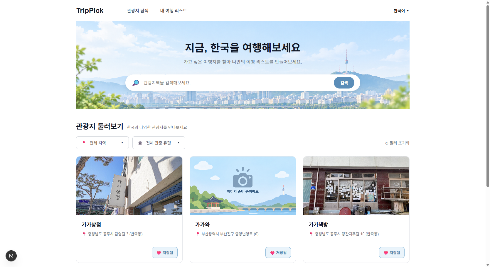
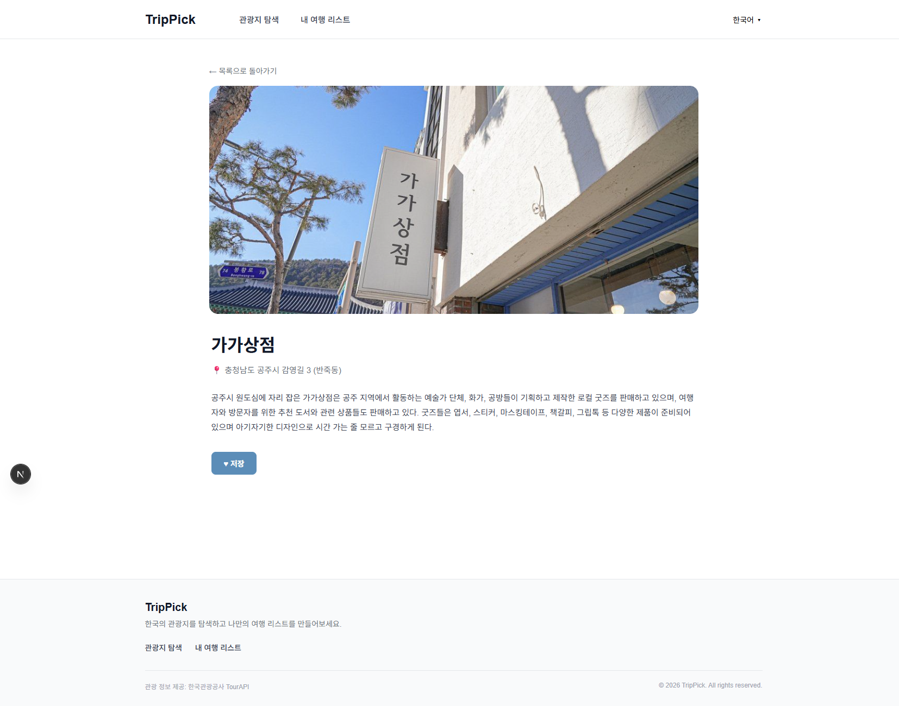
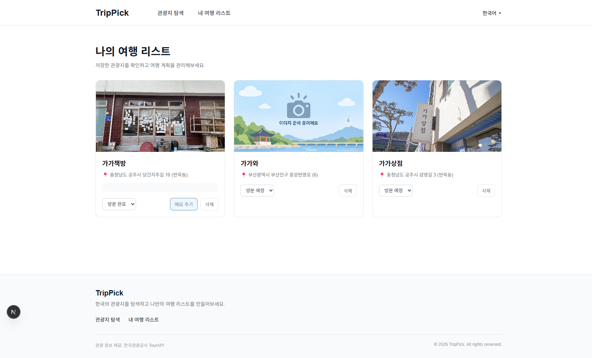
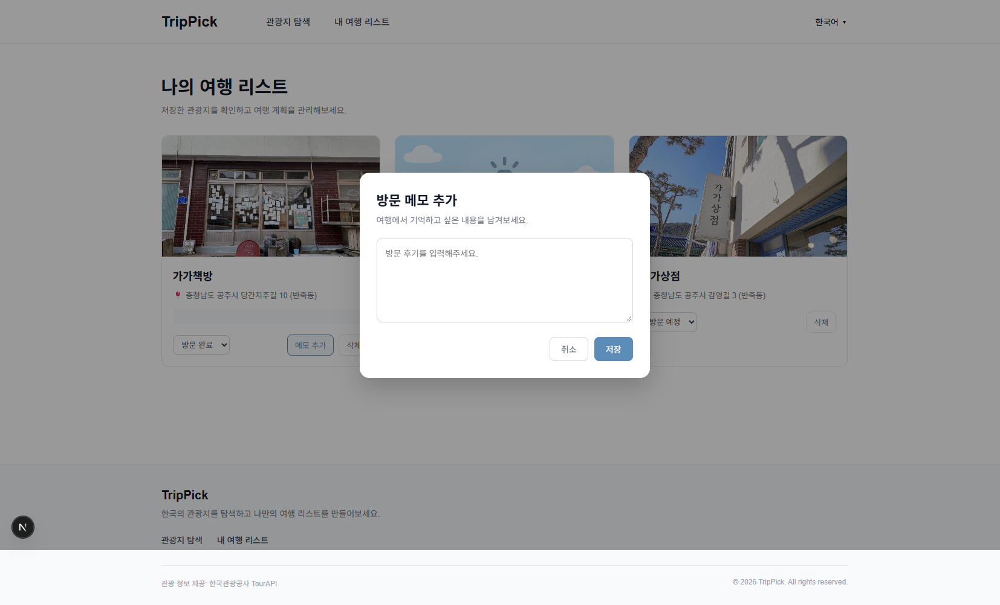

<div align="center">
  
</div>

<br>

한국의 관광지를 검색하고, 관심 있는 관광지를 저장하여 나만의 여행 리스트를 만들 수 있는 Next.js 기반 개인 프로젝트입니다.

- 개발 기간: 2026.09.28 ~ 2026.10.02
- 주요 사용자: 한국 여행지를 찾는 국내외 여행자
- 제작 목적: 한국의 다양한 관광 정보를 쉽게 탐색하고, 관심 있는 관광지를 저장하여 개인 여행 리스트를 관리할 수 있도록 제작했습니다.

---

## 주요 기능

- 한국관광공사 TourAPI를 활용하여 실제 관광지 정보를 조회할 수 있습니다.
- 키워드로 원하는 관광지를 검색할 수 있습니다.
- 지역과 관광 유형을 기준으로 관광지를 필터링할 수 있습니다.
- 관광지를 선택하면 이미지, 주소, 소개 등의 상세 정보를 확인할 수 있습니다.
- 관심 있는 관광지를 나의 여행 리스트에 저장할 수 있으며, 이미 저장된 관광지는 중복 저장되지 않습니다.
- 저장한 관광지를 `방문 예정` 또는 `방문 완료` 상태로 변경할 수 있습니다.
- 방문 완료한 관광지에는 방문 메모를 추가할 수 있습니다.
- 작성한 방문 메모를 조회, 수정, 삭제할 수 있습니다.
- 저장한 관광지를 나의 여행 리스트에서 삭제할 수 있습니다.
- 한국어, 영어, 일본어, 중국어 UI 전환 기능을 제공합니다.
- 선택한 언어는 브라우저에 저장되어 페이지 이동 및 새로고침 후에도 유지됩니다.

| 기능 | 주소 | 설명 |
|---|---|---|
| 관광지 조회/검색 | `/` | 관광지 조회, 키워드 검색, 지역 및 관광 유형 필터를 제공합니다. |
| 관광지 상세 조회 | `/tourist/[contentId]` | 관광지의 이미지, 주소, 소개 정보를 확인하고 저장할 수 있습니다. |
| 나의 여행 리스트 | `/my-trips` | 저장한 관광지의 방문 상태와 방문 메모를 관리할 수 있습니다. |

---

## 화면 구성

### 메인 화면



관광지 목록을 조회하고 키워드로 관광지를 검색할 수 있습니다.  
지역 및 관광 유형 필터를 적용할 수 있으며 원하는 관광지를 여행 리스트에 저장할 수 있습니다.

### 관광지 상세 화면



선택한 관광지의 이미지, 주소, 소개 정보를 확인할 수 있습니다.  
관광지를 나의 여행 리스트에 저장할 수 있습니다.

### 나의 여행 리스트



저장한 관광지를 확인하고 `방문 예정`, `방문 완료` 상태로 관리할 수 있습니다.  
방문 완료한 관광지에는 방문 메모를 추가할 수 있습니다.

### 방문 메모 모달



방문 메모를 모달에서 작성할 수 있으며 기존 메모를 수정하거나 삭제할 수 있습니다.

---

## 기술 스택

- Next.js
- React
- JavaScript
- CSS Modules
- Zustand
- JSON Server
- 한국관광공사 TourAPI

---

## 설치 및 실행 방법

### 1. 저장소 복제

```bash
git clone https://github.com/nahyebin/trippick.git
```

### 2. 프로젝트 폴더로 이동

```bash
cd trippick
```

### 3. 패키지 설치

```bash
npm install
```

### 4. 환경 변수 설정

프로젝트 최상위 경로에 `.env.local` 파일을 생성합니다.

```env
NEXT_PUBLIC_TOUR_API_KEY=발급받은_API_KEY
```

한국관광공사 TourAPI를 사용하기 위해서는 공공데이터포털에서 API 활용 신청 후 서비스 키를 발급받아야 합니다.

### 5. JSON Server 실행

```bash
npm run server
```

### 6. Next.js 실행

새로운 터미널을 열어 실행합니다.

```bash
npm run dev
```

### 접속 주소

- Next.js: `http://localhost:3000`
- JSON Server: `http://localhost:4000`

JSON Server와 Next.js는 각각 실행되어야 하므로 서로 다른 터미널에서 실행합니다.

---

## 폴더 구조

```text
src/
├─ api/
│  └─ api.js
│
├─ app/
│  ├─ page.js
│  ├─ page.module.css
│  ├─ tourist/
│  │  └─ [contentId]/
│  │     ├─ page.js
│  │     └─ page.module.css
│  └─ my-trips/
│     ├─ page.js
│     └─ page.module.css
│
├─ components/
│  ├─ Header
│  └─ Footer
│
├─ data/
│  └─ translations.js
│
└─ store/
   └─ filterStore.js

db.json
```

- `app`: 페이지 및 라우팅
- `components`: 공통 UI 컴포넌트
- `api`: TourAPI 및 JSON Server 요청 함수
- `store`: Zustand를 이용한 전역 상태 관리
- `db.json`: 저장한 관광지와 방문 메모 데이터 저장
- `data`: 다국어 UI에 사용되는 번역 문구 관리

---

## 주요 컴포넌트

| 컴포넌트 | 역할 |
|---|---|
| `Home` | 관광지 조회, 검색, 필터링, 저장 기능을 제공합니다. |
| `TouristDetailPage` | 선택한 관광지의 상세 정보를 조회하고 저장합니다. |
| `MyTripsPage` | 저장한 관광지의 방문 상태와 방문 메모를 관리합니다. |
| `Header` | 로고, 페이지 이동 메뉴, 언어 선택 UI를 제공합니다. |
| `Footer` | 서비스 하단 정보를 표시합니다. |

### 상태 관리

- 관광지 목록, 검색 결과, 검색어 등 현재 페이지에서 사용하는 상태는 `useState`로 관리했습니다.
- 선택한 지역, 관광 유형, 언어 설정은 Zustand를 이용하여 전역 상태로 관리했습니다.
- 언어 설정은 Zustand의 persist 미들웨어를 사용하여 브라우저에 저장하고, 페이지 이동 및 새로고침 후에도 선택한 언어가 유지되도록 구현했습니다.
- 저장한 관광지와 방문 메모는 JSON Server에 저장하여 새로고침 후에도 데이터가 유지되도록 구현했습니다.
- 관광지 정보는 한국관광공사 TourAPI를 통해 조회했습니다.

---

## 트러블슈팅

### 검색 결과에서 일부 관광지가 지역 필터에 표시되지 않는 문제

#### 문제

키워드 검색 후 지역 필터를 적용했을 때, 실제 해당 지역에 위치한 관광지임에도 검색 결과에서 제외되는 경우가 있었습니다.

#### 원인

한국관광공사 TourAPI의 검색 결과를 확인한 결과 일부 관광지 데이터에서 지역을 나타내는 `areacode` 값이 비어 있었습니다.

따라서 `areacode`만을 기준으로 지역을 비교하면 해당 관광지가 검색 결과에서 제외되었습니다.

#### 해결

`areacode`가 존재하는 경우에는 지역 코드를 비교하고, 값이 없는 경우에는 관광지의 주소인 `addr1`을 이용해 지역을 확인하도록 처리했습니다.

```javascript
if (area) {
    filtered = filtered.filter((spot) => {
        if (spot.areacode) {
            return String(spot.areacode) === String(area.code);
        }

        const areaName = AREA_NAMES[String(area.code)];

        return spot.addr1?.startsWith(areaName);
    });
}
```

#### 알게 된 점

외부 API를 사용할 때 모든 데이터가 항상 동일한 형태로 제공된다고 가정하면 안 된다는 것을 알게 되었습니다.

API 응답을 직접 확인하고 값이 없거나 예상과 다른 경우까지 고려하여 데이터를 처리하는 것이 중요하다는 것을 경험했습니다.

---

## 프로젝트 회고

이번 프로젝트를 통해 주제 선정부터 화면 구성, 외부 API 연결, 상태 관리까지 직접 구현하면서 하나의 서비스를 만드는 전체적인 과정을 경험할 수 있었습니다.

특히 한국관광공사 TourAPI와 JSON Server를 함께 사용하면서 외부 API에서 관광지 정보를 조회하는 것과 사용자가 저장한 데이터를 별도로 관리하는 방식의 차이를 이해할 수 있었습니다. 또한 검색과 필터 기능을 구현하면서 API에서 받은 데이터를 화면에서 필요한 형태로 가공하고 관리하는 과정을 경험했습니다.

구현 과정에서 API 응답이 예상과 다르거나 데이터가 정상적으로 필터링되지 않는 문제도 있었지만, 실제 응답 값을 확인하면서 원인을 찾고 해결하는 과정이 중요하다는 것을 알게 되었습니다.

추후에는 Next.js Route Handler를 활용하여 API 키를 서버 측에서 관리하는 구조로 개선하고, 현재 한국어로 제공되는 관광지 데이터도 언어 선택에 따라 영어, 일본어, 중국어 관광 정보를 제공할 수 있도록 확장해 보고 싶습니다.